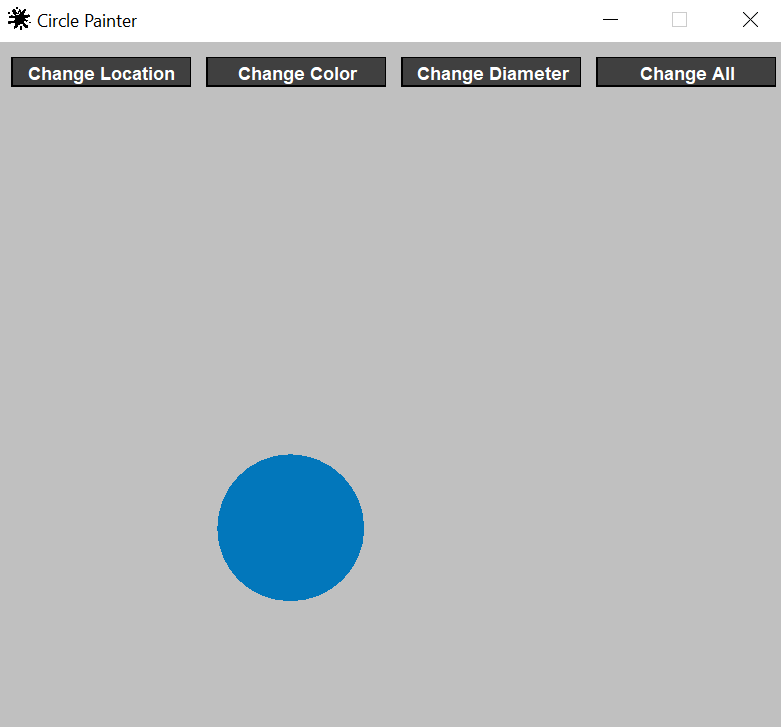

# CirclePainter
**CirclePainter** is a demo project for paintig shapes in user interfaces.

---

## Features
- paint circle with random location/diameter/color
- paint circle with random location, diameter and color

### Preinstalled dependencies
- [ConsoleLogger](https://github.com/TillSim/HelperClass-ConsoleLogger)
- [Filehandler](https://github.com/TillSim/HelperClass-FileHandler) (dependency of ConsoleLogger)
